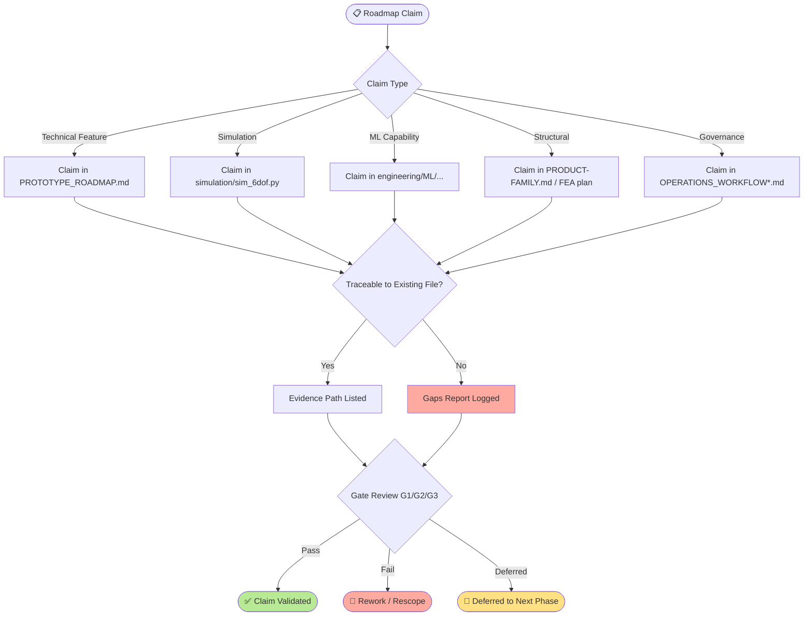
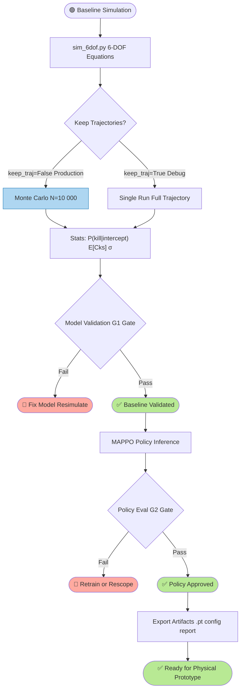
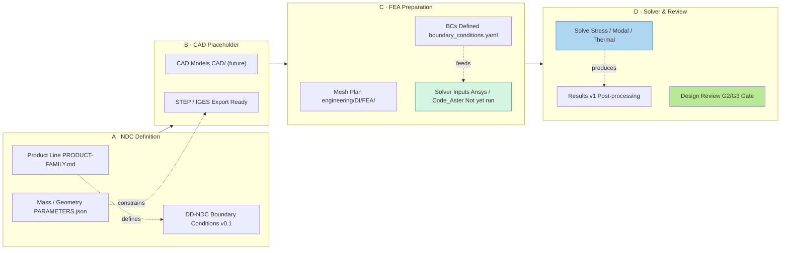
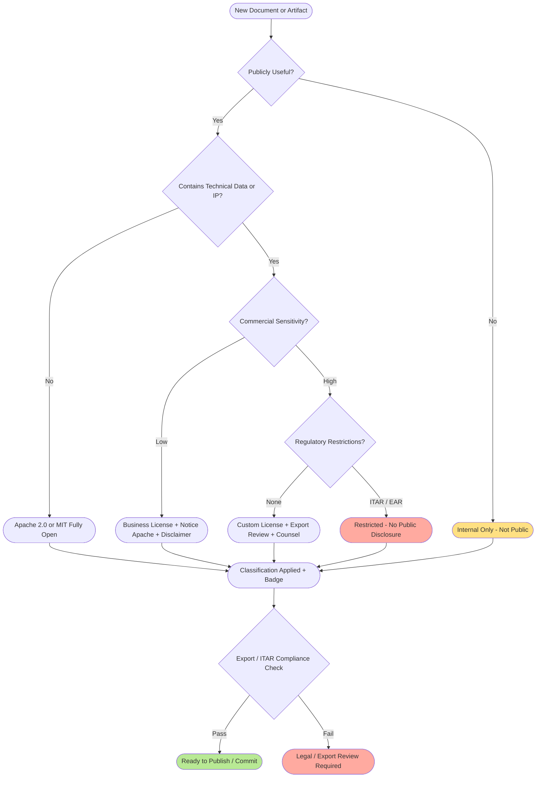
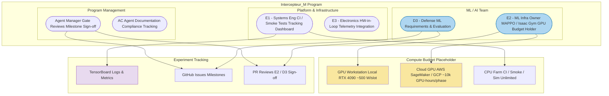

> **⚠ Notice — Conceptual / Traceability Only**  
> All diagrams below are abstract process and architecture schematics for program traceability, documentation, and governance purposes. They do **not** contain fabrication dimensions, launcher details, weaponization steps, or actionable construction instructions. Treat as internal engineering documentation.

---

## 1 · Roadmap Claims Traceability Lifecycle

---

## 2 · MAPPO + Isaac Gym Training Architecture

```mermaid
flowchart LR
    subgraph Setup["A · Scenarios & Configuration"]
        SC["Swarm Scenarios swarm_env.py"]
        CF["MAPPO Config hyperparameters.yaml"]
        SEED["Random Seed experiment.yaml"]
    end
    subgraph Env["B · Environment"]
        IG["Isaac Gym Env GPU"]
        IG_CPU["CPU Fallback NumPy Wrapper"]
    end
    subgraph Rollout["C · Rollout Workers"]
        RW1["Worker 1 Policy πθ"]
        RW2["Worker 2 Policy πθ"]
        RW3["Worker N Policy πθ"]
        RW1 --- RW2 --- RW3
    end
    subgraph Train["D · MAPPO Learner"]
        BUF["Rollout Buffer Trajectories"]
        GA["GAE Advantage Estimation"]
        LSTM["Shared LSTM Encoder"]
        ATTN["Attention Over Agents"]
        PP["PPO Clipping Loss Lπ"]
        VL["Value Head Loss LV"]
        OPT["Adam Optimizer lr → θ"]
    end
    subgraph Eval["E · Evaluation & Artifacts"]
        EVAL["Gym Eval Success Rate"]
        CKPT["Model Checkpoint .pt / .onnx"]
        TB["TensorBoard Logs"]
        TR["Training Report markdown"]
    end
    Setup --> Env
    Env --> Rollout
    Rollout --> Train
    Train --> Eval
    SC -.->|"Isaac Gym GPU"| IG
    CF -.->|"GPU Training"| IG
    SC -.->|"CPU Smoke Test"| IG_CPU
    CF -.->|"Unit / CI Run"| IG_CPU
    style IG fill:#aed6f1,stroke:#2980b9
    style IG_CPU fill:#d5f5e3,stroke:#27ae60
    style Train fill:#f9e79f,stroke:#f39c12
    style EVAL fill:#e8daef,stroke:#8e44ad
```

---

## 3 · Simulation-to-Validation Workflow

---

## 4 · FEA / NDC Documentation Workflow

---

## 5 · Confidentiality & License Decision Flow

---

## 6 · Staffing & Compute Responsibility Map

---

## 7 · Traceability Matrix Summary

| Roadmap Claim | Evidence File | Status |
|---|---|---|
| 6-DOF simulation baseline | simulation/sim_6dof.py | ✅ Implemented |
| Monte Carlo kill analysis | simulation/sim_6dof.py (simulate_engagement) | ✅ Implemented |
| Isaac Gym swarm env | engineering/ML/isaac_gym/swarm_env.py | ✅ Present (CPU wrapper) |
| MAPPO RL training pipeline | engineering/ML/mappo/ | 📋 Scaffolded |
| Product family / NDC definition | PRODUCT-FAMILY.md | 📋 Documented |
| FEA boundary conditions | engineering/DI/ placeholder | ⚠️ Gaps - CAD/FEA missing |
| Governance gate model | OPERATIONS_WORKFLOW*.md | ✅ Implemented |
| CI / smoke test infrastructure | TBD (E1 planned) | ⚠️ Not yet in repo |
| GPU/cloud budget | TBD (E2/D3) | ⚠️ Placeholder only |

---

## 8 · Quick Reference - File Index

| Purpose | Path |
|---|---|
| Program overview | README.md |
| Governance & gates | OPERATIONS_WORKFLOW_V2.md |
| Baseline simulation | simulation/sim_6dof.py |
| ML training | engineering/ML/mappo/ |
| Isaac Gym env | engineering/ML/isaac_gym/swarm_env.py |
| Product NDC | PRODUCT-FAMILY.md |
| FEA plan placeholder | engineering/DI/ |
| Parameters / mass | PARAMETERS.json |
| Prototype roadmap | PROTOTYPE_ROADMAP.md |
| Bot / agent rules | BOT_GUIDELINES.md, rules.md |
| **This file** | docs/SCHEMATICS.md |

---

*Maintained by: Agent Manager & AC Agent - update when gates pass or scope changes.*
