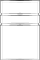
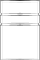

# PyCad Technical Data Sheet: SABOT-001

## Engineering Metadata
| Property | Value |
| :--- | :--- |
| **material** | Nylon |
| **density** | 0.0011 |
| **revision** | v1.1-L3 |
| **Watertight Integrity** | PASSED |

## Physical Properties (SI Units)
- **Mass**: 0.0118 kg (11.78 g)
- **Volume**: 10712.81 mm³
- **Surface Area**: 10337.85 mm²
- **Center of Gravity (mm)**: X=0.00, Y=-0.01, Z=1.10

## Inertia Tensor (kg.m²)
```json
[
  [
    3.941447897836477e-06,
    -1.5050362697901854e-17,
    -1.8806192702929604e-14
  ],
  [
    -1.5050362697901854e-17,
    3.9494850238871065e-06,
    4.17890127913774e-09
  ],
  [
    -1.8806192702929604e-14,
    4.17890127913774e-09,
    4.140318150570298e-06
  ]
]
```

## Manufacturing Files
- [STEP Model](./SABOT-001.step)
- [STL Model](./SABOT-001.stl)

## Technical Drawings
  
